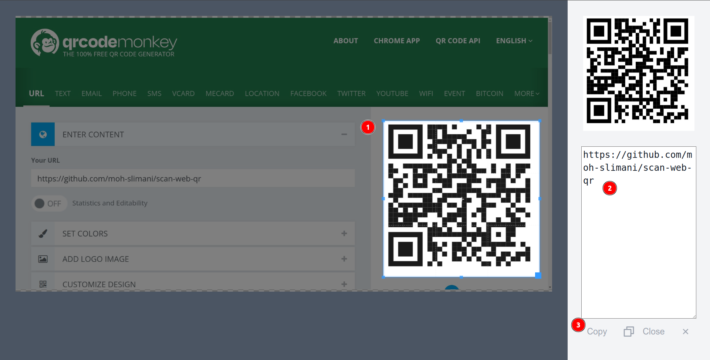

# Scan Web Qr

A fast way to scan Qr codes on the web with taking a screenshot and get the text quickly

 

## Features

- ⚡️ **Instant Scan** - get the text from any Qr code on anny web page instantly 
- 📄❌ No upload needed
- 📷❌️ No Camera needed
- 📋️ Copy to clipboard with one click
- 🦾 View and edit the text before before copy

## Author

[Mohamed Slimani](https://github.com/moh-slimani)

## Credits

[WebExtension Vite Starter](https://github.com/antfu/vitesse-webext)
